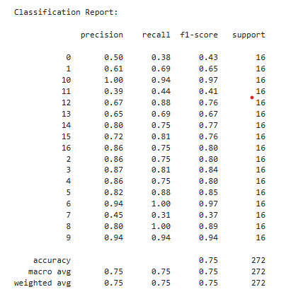
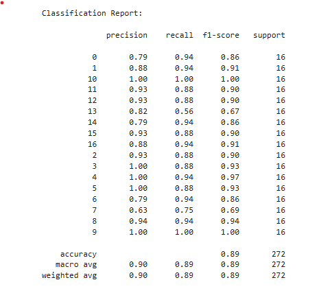
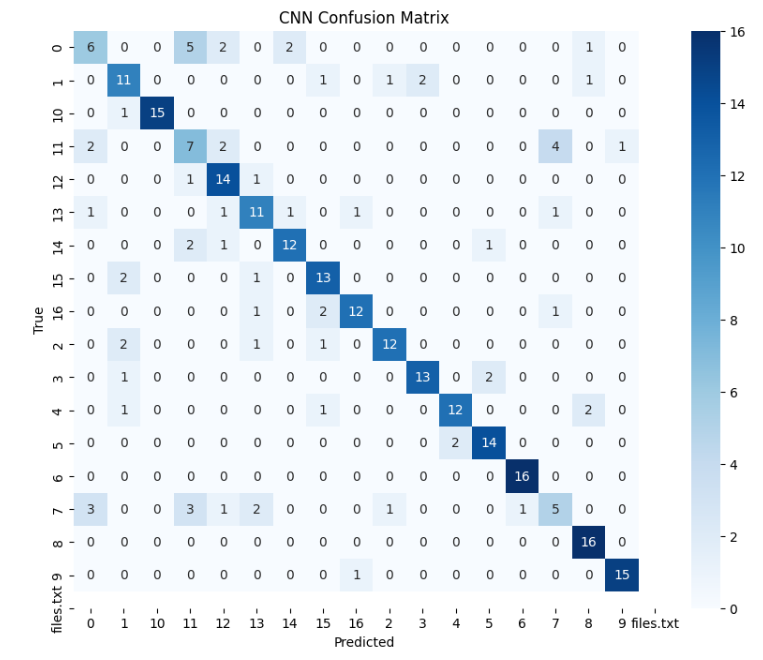
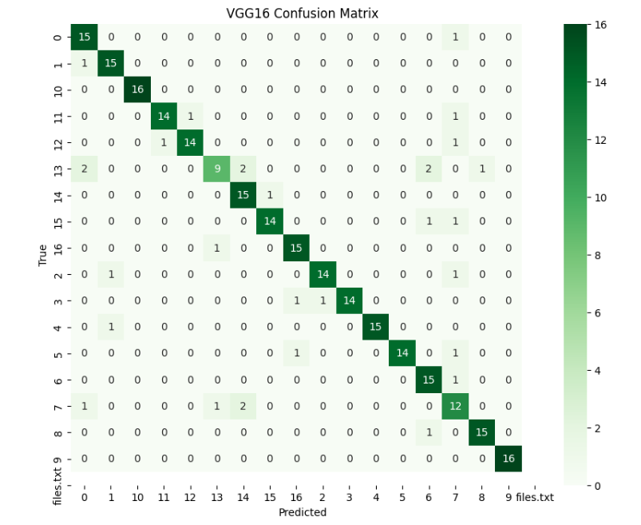
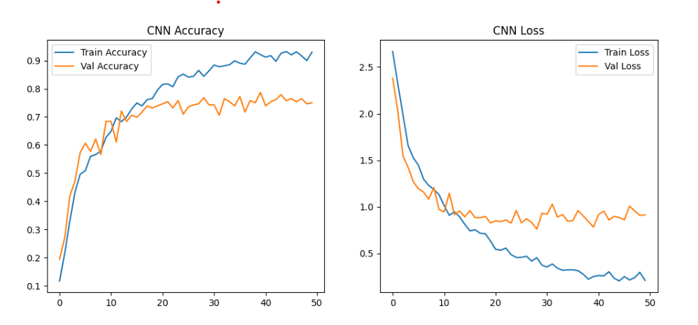
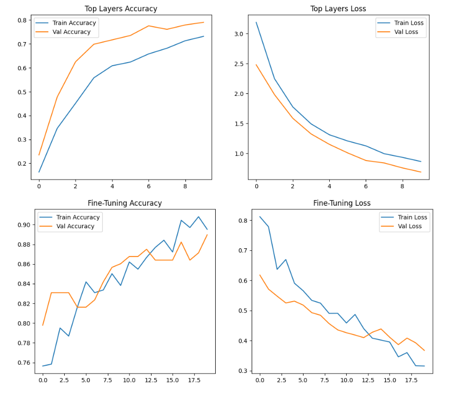
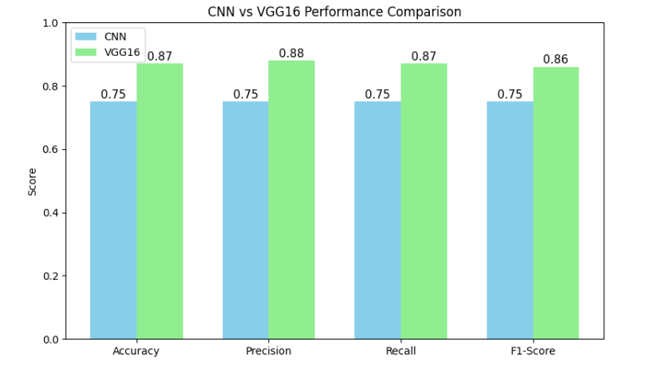
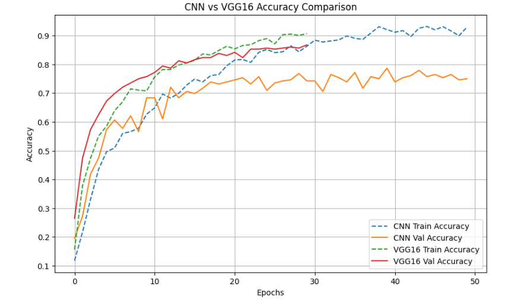

# 🌸 Flower Classification Using CNN & VGG16  

## 📘 Overview  
This project focuses on classifying **17 different flower categories** using deep learning models — a **Custom Convolutional Neural Network (CNN)** and a **Transfer Learning model (VGG16)**.  
The goal is to automatically identify flower species from images with **high accuracy**.

Image classification plays a critical role in **agricultural automation**, **biodiversity tracking**, and **plant identification** applications.  
By leveraging modern CNN architectures, this project achieves strong classification performance and includes a **Streamlit web app** for real-time flower prediction.  

---

## 🌼 Dataset Source  
**Dataset:** [Oxford 17 Category Flower Dataset](https://www.robots.ox.ac.uk/~vgg/data/flowers/17/)  
- **Number of Categories:** 17  
- **Total Images:** 1,360 (80 images per category)  
- **Image Size:** 128 × 128 pixels (resized during preprocessing)  
- **Format:** JPEG  

---

## 🧹 Preprocessing Steps  
1. Loaded all images from the `Data/` directory.  
2. Filtered only valid image folders (ignored hidden/system files).  
3. Resized all images to **(128 × 128)** for uniformity.  
4. Normalized pixel values (`/255.0`).  
5. One-hot encoded the labels.  
6. Split into **train/test (80/20)**.  
7. Saved class mapping (`class_names.npy`) for consistent label alignment during inference.  

---

## 🧠 Methods  

### 1️⃣ Custom CNN Model  
**Architecture:**  
- Input Layer: (128×128×3)  
- 3 × Convolution + MaxPooling blocks  
- Flatten Layer  
- Dense (256, ReLU)  
- Dropout (0.5)  
- Output Layer (Softmax for 17 classes)  

**Optimizer:** Adam (Exponential Decay Learning Rate)  
**Loss Function:** Categorical Crossentropy  
**Data Augmentation:** Rotation, Zoom, Horizontal Flip  

---

### 2️⃣ Transfer Learning with VGG16  
**Base Model:** Pretrained **VGG16** (on ImageNet, without top layers)  

**Custom Layers Added:**  
- Flatten  
- Dense (512 → BatchNorm → Dropout)  
- Dense (256 → BatchNorm → Dropout)  
- Dense (17, Softmax)  

**Training Phases:**  
1. Train only custom top layers (frozen base).  
2. Fine-tune last 4 convolutional layers of VGG16 with smaller learning rate.  

**Optimizer:** Adam (learning rate scheduling applied)  

---

## 🧩 Model Comparison  

| Model | Accuracy | Training Time | Comments |
|:------|:----------:|:--------------:|:----------|
| **Custom CNN** | ~75% | Faster | Lightweight baseline, quick convergence |
| **VGG16 (Fine-tuned)** | ~87% | Slower | Strong generalization and robust performance |

---

## 🚀 Steps to Run the Code  

### 🧰 Prerequisites  
Install the required dependencies:  
```bash
pip install tensorflow numpy matplotlib seaborn scikit-learn streamlit
```

### ▶️ Training
Run the Jupyter Notebook to train both models:  
```bash
jupyter notebook Model_CNN.ipynb
jupyter notebook Model_Vgg.ipynb
```

### 💾 Model Saving
After training, models will be saved as:
```bash
- cnn_model.h5
- vgg16_model.h5
```

### 💻 Streamlit Web App
Run the Streamlit app for real-time predictions:  
```bash
streamlit run app.py
```

## 📊 Experiments & Results  

**Evaluation Metrics:**  

- Classification Report
    
  
  
  
- Confusion Matrix
  
  
   

### 🧠 CNN Performance  
- **Accuracy:** ~75%  
- **Training Speed:** Fast  
- **Comment:** Lightweight and effective baseline model  

### 🌺 VGG16 Fine-Tuned Performance  
- **Accuracy:** ~87%  
- **Generalization:** Strong performance on unseen data  
- **Comment:** Outperformed baseline CNN and provided more robust classification results  

---

## 🧩 Visualization Examples  

### 📈 Training Curves  
Accuracy and Loss trends for both models show **stable convergence** across epochs, demonstrating effective learning and minimal overfitting. 





### 📊 Model Comparison 
Models achieved **clear class separations** with minimal misclassification after fine-tuning, especially in the VGG16 model.  




---

## 🏁 Conclusion  

This project successfully demonstrates how **deep learning techniques** can be applied to **flower classification** with impressive accuracy.  

### 🔑 Key Takeaways  
- 🌼 **Custom CNNs** are lightweight and efficient for smaller datasets.  
- 🌸 **Transfer Learning (VGG16)** significantly improves accuracy and generalization.  
- 🌻 The approach can be extended to **other plant species or agricultural image datasets** for broader real-world applications.  

